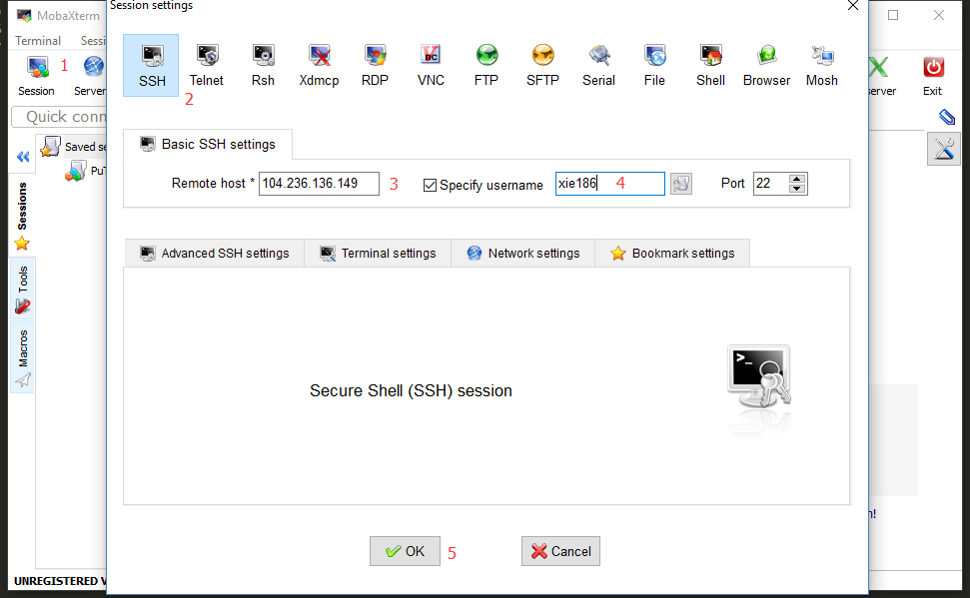
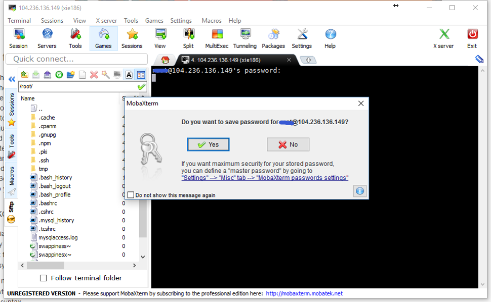

# Connecting to Linux

## User interfaces

As an operating systemsm, Linux comes with two types of user interfaces: Graphical User Interface (GUI) and command line interface (shell).

GUI means there will be window, buttons, menus, etc. The most popular system with GUI is Windows system (Figure \@ref(fig:windowsGUI)).

(ref:windowsGUI) Windows GUI. 

```{r windowsGUI, fig.cap='(ref:windowsGUI)', outwidth="100%", echo=FALSE}
knitr::include_graphics("figures/windows_gui.png")
```

Command line interfaces means that you need to type the command line yourself. Usually the results will be displayed as text (Figure \@ref(fig:linuxTerminalExam2)). 

(ref:linuxTerminalExam2) An example of Linux terminal.

```{r linuxTerminalExam2, fig.cap='(ref:linuxTerminalExam2)', outwidth="100%", echo=FALSE}
knitr::include_graphics("figures/linux_terminal_exam2.png")
```

In Bioinformatics analysis, usually you won't operate directly on the physical machine of the Linux server. Usually you need to connect to the Linux server via a tool, like Putty, Mobaxterm, etc. 

## How to connect

If you want to connect to a Linux server, what you need to know first is:

1) IP address of your Linux server;

2) User name and password of your account;

If you are a Mac OS X user, you can connect to a Linux server by using `Terminal`, a console program included with the operating system. 

For Windows users, I would recommend MobaXterm for remote connection. MobatXterm is an excellent toolbox for remote connection from Windows system. It comes with an X11 server and provides many networking tools and tabbed SSH. It has all the essential UNIX commands in a single portable executable file.

Here I show one example of what you should do When you first open Mobaxterm. You need to follow the numbers in Figure \@ref(fig:mobaxtermInit): click `Session`; then click `SSH`; type the IP or name address of the remote host, check `Specify username` if you need; click `OK`. 

(ref:mobaxtermInit) First open of Mobaxterm.

```{r mobaxtermInit, fig.cap='(ref:mobaxtermInit)', outwidth="100%", echo=FALSE}

```

Then you need to type the password. It's OK that you don't see anything when you're typing (Figure \@ref(fig:mobaxtermSavepswd)). Then click `Enter` on the keyboard.For the first time of log-in, you'll be asked to whether to save the password or not. If you say click `Yes`, you won't need to type the password again next time. 

(ref:mobaxtermSavepswd) Type password and save it in Mobaxterm.

```{r mobaxtermSavepswd, fig.cap='(ref:mobaxtermSavepswd)', outwidth="100%", echo=FALSE}

```

If you can find a Linux server, it'll be very good for you to practise. If you are a student or a researcher in a university or an institute, usually you can get an account from your department.  

If NOT, here I provided a guest account for you. Here are the user name and password:

```
IP address: 198.211.107.37
User name: guest4bioinfo
Password: nobigfile
```

As you can tell from the password, please do NOT upload BIG files (bigger than 2 MB).

### DigitalOcean droplet 

Another option is to sign up on DigitalOcean and create a droplet. DigitalOcean calls its cloud servers Droplets; each Droplet you create is a new server for your personal use. DigitalOcean has a tutorial of [**How To Create Your First DigitalOcean Droplet**] (https://www.digitalocean.com/community/tutorials/how-to-create-your-first-digitalocean-droplet). You can get a your own Linux server with a $5 monthly payment. 

The Linux server with IP address of `198.211.107.37` is a droplet on DigitalOcean. I pay $5 each month for this droplet. 

### AWS Free Tier offering

One more way to get access to a Linux system is to take advantage of Red Hat Enterprise Linux delivered by Amazon EC2 (Elastic Compute Cloud). Red Hat and Amazon Web Services collaborate to provide official Red Hat Enterprise Linux licensed images through Amazon’s on-demand public cloud service at free or low cost.

The guided exercises and labs for this course were written assuming that you will set up an account with Amazon Web Services and use it to start a single, simple system running Red Hat Enterprise Linux 7. You will connect to that system securely over the internet and use it to practice commands.

At the time of writing, Amazon Web Services provides an AWS Free Tier offering, which gives new users free access to certain sizes of cloud instances and operating environments (including Red Hat Enterprise Linux 7) for up to 750 hours per month, for 12 months.


