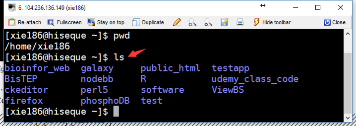
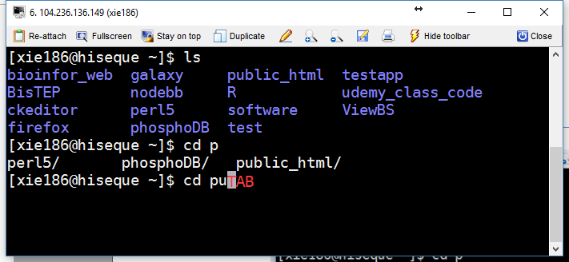

# File system and commands of Linux

## Path

To understand Linux file system, you can image it as a tree structure (Figure \@ref(fig:linuxTreeStruc)). 

(ref:linuxTreeStruc) Tree structure of Linux system. 

```{r linuxTreeStruc, fig.cap='(ref:linuxTreeStruc)', outwidth="100%", echo=FALSE}
knitr::include_graphics("figures/LinuxPathTree.png")
```

In Linux, a path is a unique location of a file or a directory in the file system. 

For convenience, the Linux file system is usually thought of in a tree structure. On a standard Linux system you will find the layout generally follows the scheme presented below.

The tree of the file system starts at the trunk or slash, indicated by a forward slash (/). This directory, containing all underlying directories and files, is also called the root directory or "the root" of the file system.

### Relative and absolute path

```{sh echo=FALSE, eval=FALSE}
This path I copied from the path.
http://www.linuxnix.com/abslute-path-vs-relative-path-in-linuxunix/
```

* __Absolute path__

An absolute path is defined as the location of a file or directory from the root directory(/). An absolute path starts from the `root` of the tree (`/`).

Here are some examples:

```
/home/xie186
/home/xie186/perl5
```
* __Relative path__

### Path shortcuts

In Linux, there are three commonly used path shortpaths (Table \@ref(tab:linuxPathShortcuts)).

(ref:linuxPathShortcuts) Shortcuts of path.

```{r linuxPathShortcuts, echo=FALSE}
tab<-read.csv("tables/linuxPathShortcuts.csv", fileEncoding="UCS-2LE")
knitr::kable(tab, caption = '(ref:linuxPathShortcuts)', booktabs = TRUE)
```

```{sh comment=NA}
pwd
cd ../
pwd
cd ./
pwd
```

Each directory has two entries in it at the start, with names . (a link to itself) and .. (a link to its parent directory). The exception, of course, is the root directory, where the .. directory also refers to the root directory.

## Surfing in Linux file system

Once we enter into a Linux file system, we need to 1) know where we are; 2) how to get where we want; 3) how to know what files or directories we have in a particular path. 

###	Command `pwd`

In order to know where we are, we need to use `pwd` command. The command `pwd` is short for “print name of current/working directory”. It will return the full path of current directory.

Command pwd is almost always used by itself. This means you only need to type pwd and press ENTER (Figure \@ref(fig:linuxCMDpwd)). 

(ref:linuxCMDpwd) Linux command `pwd`

```{r linuxCMDpwd, fig.cap='ref:linuxCMDpwd', out.width="80%", fig.align='center', echo=FALSE}
knitr::include_graphics("figures/linuxCMDpwd.png")
```

### Comand `ls`

After you know where you are, then you want to know what you have in that 
directory, we can use command `ls` to list directory contents (Figure \@ref(fig:linuxCMDls)). Its syntax is:

```
ls [option]... [file]...
```

(ref:linuxCMDls) Linux command `ls`


```{r linuxCMDls, fig.cap='ref:linuxCMDls', out.width="80%", fig.align='center', echo=FALSE}

```

`ls` with no option will list files and directories in bare format. Bare format means the detailed information (type, size, modified date and time, permissions and links etc) won’t be viewed. When you use `ls`  by itself (Figure \@ref(fig:linuxCMDls)), it will list files and directories in the current directory. 

###	Command `cd`

Command cd is used to change the current directory. It’s syntax is:

```
cd [option] [directory]
```

Unlike `pwd`, when you use `cd` you usually need to provide the path (either absolute or relative path) which we want to enter. 
 
If we didn’t provide any path information, we will change to home directory by default.


## Manipulations of files and directories

In Linux, manipulations of files and directories are the most frequent work. In this section, you will learn how to copy, rename, remove, and create files and directories. 

### Command `cp`

In Linux, command `cp` can help you copy files and directories into a target directory. 


###	Command `mv`

The command `mv` is short for move (or rename) files. 

#### Move one file

Here is one common example of `mv`. 

```{sh eval=FALSE}

mv file1 directory1/

```

#### Move multiple files into a directory

```{sh eval=FALSE}
mv file1 file2 file3 target_direcotry/
```

#### Move a directory

```{sh eval=FALSE}
mv dir1
```

#### Rename a file or a directory


###	Command `mkdir`

Command `mkdir` is short for make directory. 

The syntax is shown as below:

```
mkdir [OPTION ...] DIRECTORY ...
```

```{sh eval=FALSE}
mkdir directory
```

Multiple directories can be specified when calling `mkdir`.

```{sh eval=FALSE}
mkdir directory1 directory2
```

## Viewing text files in Linux

###	Command `cat`

The command `cat` is short for concatenate files and print on the standard output. 

The syntax is shown as below:

```
cat [OPTION]... [FILE]...
```

For small text file, `cat` can be used to view the files on the standard output. 

```{sh}
cat data/testdata4linux_cmd.txt
```

You can also use `cat` to merge two text files. 

```{sh eval=FALSE}
cat file1 file2 > merged_file
```

###	Command `more` and `less`

The command `more` is old utility. When the text passed to it is too large to fit on one screen, it pages it. You can scroll down but not up. 

The syntaxt of `more` is shown below:

```
more [options] file [...]
```

The command `less` was written by a man who was fed up with more's inability to scroll backwards through a file. He turned less into an open source project and over time, various individuals added new features to it. less is massive now. That's why some small embedded systems have more but not less. For comparison, less's source is over 27000 lines long. more implementations are generally only a little over 2000 lines long.

The syntaxt of `less` is shown below:

```
less [options] file [...]
```

###	Command `head` and `tail`

The command `head` is used to output the first part of files. By default, it outputs the first 10 lines of the file. 

```
head [OPTION]... [FILE]...
```

Here is an exmaple of printing the first 5 files of the file: 

```{sh}
head -n 5 code_perl/variable_assign.pl
```

In fact, the letter n does not even need to be used at all. Just the hyphen and the integer (with no intervening space) are sufficient to tell head how many lines to return. Thus, the following would produce the same result as the above commands:

```{sh}
head -5 data/testdata4linux_cmd.txt
```

The command `tail` is used to output the last part of files. By default, it prints the last 10 lines of the file to standard output.

The syntax is shown below:

```
tail [OPTION]... [FILE]...
```

Here is an exmaple of printing the last 5 files of the file: 

```{sh}
tail -5 data/testdata4linux_cmd.txt
```

To view lines from a specific point in a file, you can use `-n +NUMBER` with the `tail` command. For example, here is an example of viewing the file from the 2nd line of the line. 

```{sh}
tail -n +2 data/testdata4linux_cmd.txt
```

###	Auto-completion

In most Shell environment, programmable completion feature will also improve your speed of typing. It permits typing a partial name of command or a partial file (or directory), then pressing `TAB` key to auto-complete the command (Figure \@ref(fig:linuxAutoCompletion)). If there are more than one possible completions, then TAB will list all of them (Figure \@ref(fig:linuxAutoCompletion)). 

(ref:linuxAutoCompletion) Demonstration of programmable completion feature.

```{r linuxAutoCompletion, fig.cap='(ref:linuxAutoCompletion)', outwidth="100%", echo=FALSE}

```

## Understand standard input and stardard output

In the Linux environment, input and output is distributed across three streams: standard input (STDIN), standard output (STDOUT),  standard error (STDERR). These three streams are also numbered: STDIN (0), STDOUT (1), STDERR (2).

### STDIN

...
The standard input stream typically carries data from a user to a program. Programs that expect standard input usually receive input from a device, such as a keyboard. Standard input is terminated by reaching EOF (end-of-file). As described by its name, EOF indicates that there is no more data to be read.

To see standard input in action, run the cat program. Cat stands for concatenate, which means to link or combine something. It is commonly used to combine the contents of two files. When run on its own, cat opens a looping prompt.
...

```
tail
1
2
3
`CTRL+D`
1
2
3
```

### STDOUT

Data that is generated by a program will be written by STDOUT. If the STDOUT is not redirected, it will output the data on to the terminal. 

```{sh}
stdout="Hello world"
echo $stdout
```

The STDOUT can be redirected to a file. See the example below:

```{sh}
stdout="Hello world"
echo $stdout > data/test_output.txt
# cat the data
cat data/test_output.txt
```

### STDERR

During a program's execution, some errors may be generated when the program fails at some parts. STDERR will help you write the errors. By default, the STDERR will be outputed onto the terminal. 

Here is an example of STDERR

```{sh error=TRUE}
ls NOTAFILE
```
