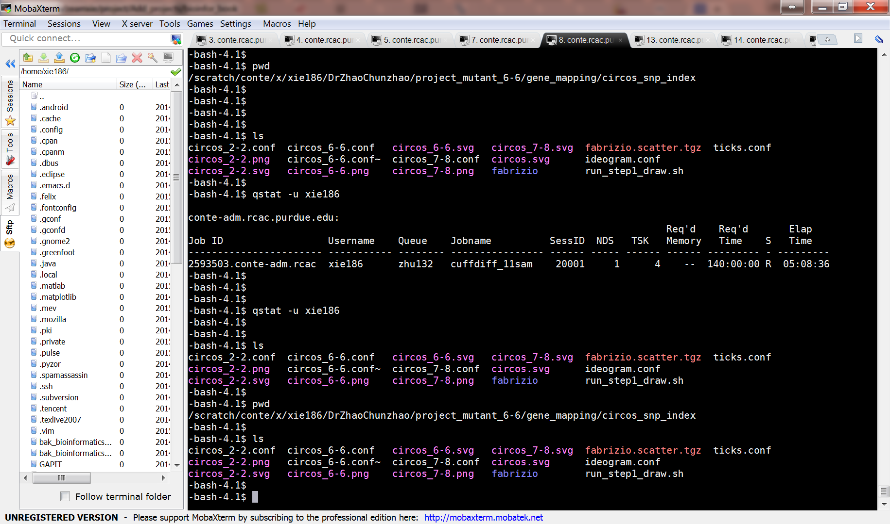
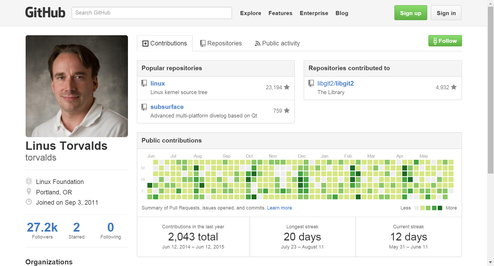
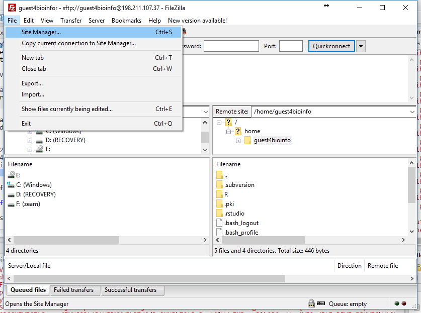
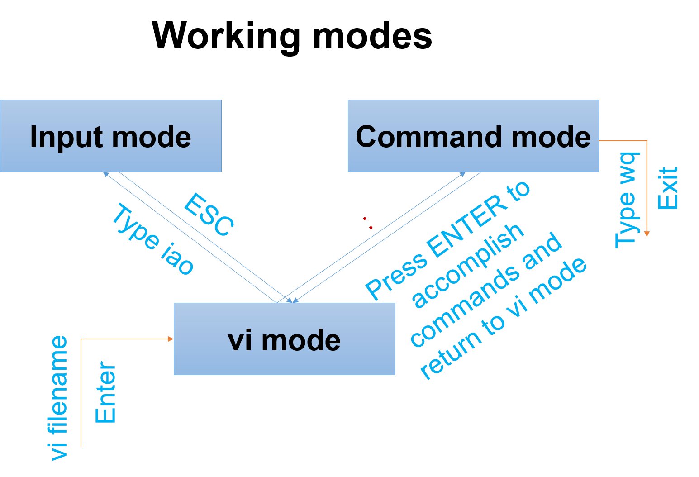
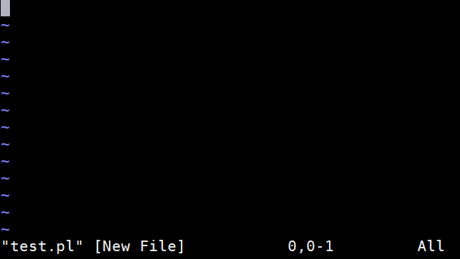
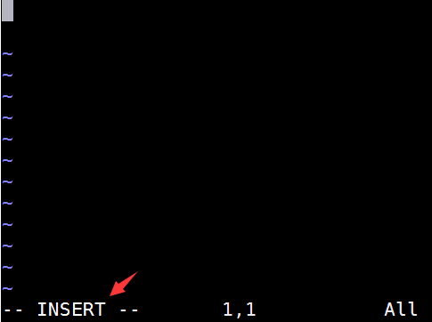
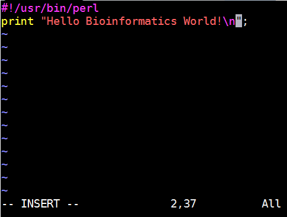
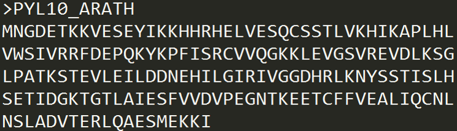
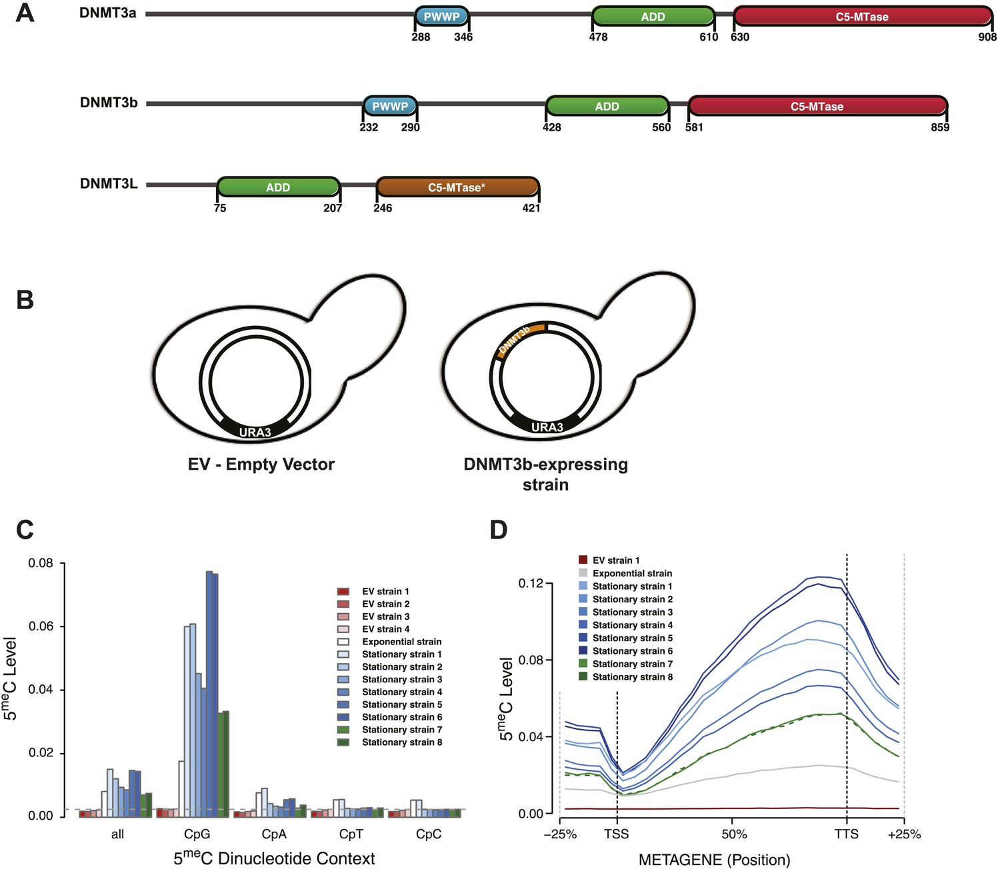

--- 
title: "All things considered for Bioinformatics"
subtitle: "Essential Linux, Python, Perl, R and Statistics in life science"
author: "Shaojun Xie (解少俊)"
date: "`r Sys.Date()`"
site: bookdown::bookdown_site
output: bookdown::gitbook
documentclass: book
bibliography: [book.bib, packages.bib]
biblio-style: apalike
link-citations: yes
github-repo: xie186/Novice2Expert4Bioinformatics
description: "This is a book for people who wants to learn Bioinformatics from scratch"
cover-image: images/cover.jpg
---

# Preface {-}

```{r fig.align='center', echo=FALSE, include=identical(knitr:::pandoc_to(), 'html'), fig.link=''}
knitr::include_graphics('images/cover_fishingMan.jpg', dpi = NA)
```


```{r echo=FALSE}

# https://stackoverflow.com/questions/4090169/elegant-way-to-check-for-missing-packages-and-install-them
list.of.packages <- c("bookdown", "knitr", "pheatmap")
new.packages <- list.of.packages[!(list.of.packages %in% installed.packages()[,"Package"])]
if(length(new.packages)) install.packages(new.packages, dependencies = T)

source("https://bioconductor.org/biocLite.R")
list.of.bioconductorpakg <- c("ropls")
new.packages <- list.of.bioconductorpakg[!(list.of.bioconductorpakg %in% installed.packages()[,"Package"])]

BiocInstaller::biocLite(new.packages, suppressUpdates=TRUE)
```


<!--chapter:end:index.Rmd-->

```{r echo=F}

## Who should read this book? {-}

#I started to do NGS data analysis as a bench researcher. I started from ZERO. I understand how people feel when they were ZERO. So this book is written for researchers who have no prior knowledge of NGS data analysis. You do NOT need any programming background. If you already have some, that’s good. All you need is the strength and the resolution to finish this book. 

#For those of you who already have some experience but you still don’t feel comfortable when dealing with the data, this will be for you. In this book, I will write some skills that I have learned, which will accelerate your analysis. 

## How to read this book? {-}

#This is not a sci-fiction books. This is a technical book. I highly recommend you to practice when you're reading this book. 

#*__Don’t panic!__*

```

<!--chapter:end:00_about_me_acknowledge.Rmd-->

# (PART) Linux {-}

# Why Linux?

## What is Linux

Before the creation of Linux, Unix was developed by AT&T Bell Labs in the 1960’s. It’s an operating system. Before the creation of Linux, and before the rise of Windows, the computing world was dominated by Unix (from web). After many years of evolution, Linux was created in early 1990’s. 

In case you don’t know, Mac OS X is also a certified Unix operating system. So most of the Linux skills are applied in Mac OS X. 

Linux is a clone of the operating system Unix, written from scratch by Linus Torvalds (Figure \@ref(fig:LinuxTerminal)) with assistance from a loosely-knit team of hackers across the Net. It aims towards POSIX and Single UNIX Specification compliance (@Torvalds2015).

(ref:LinuxTerminal) An example of Linux terminal.

```{r LinuxTerminal, fig.cap='(ref:LinuxTerminal)', out.width="100%", echo=FALSE, fig.align='center'}

```


It has all the features you would expect in a modern fully-fledged Unix, including true multitasking, virtual memory, shared libraries, demand loading, shared copy-on-write executables, proper memory management, and multistack networking including IPv4 and IPv6. It is distributed under the GNU General Public (Torvalds, 2015). 

Maybe it’s hard to understand what Linux or to remember the sentences mentioned above. Just know Linux is an operating system like Windows. This is enough for you to start out. 

```{r LinusTorvaldsGitHub, fig.cap='Linus Torvalds on GitHub', out.width="50%", fig.align='center', echo=FALSE}

```


## Linux for bioinformatics

For analysis of NGS data, a large amount of software were developed for using under Linux environment. Among them, a large proportion can be only used under Linux environment. 

* Easy to build simple pipelines 
  (awk, bash, piping, bash redirection, texttools) 
* Simple to install and use software development tools
* Multiple versions of a program can be installed by the user himself and switched on/off with sourcing some scripts without being administrator
* A lot of good scientific software is written in a non portable way for linux/unix (almost all short read aligners, samtools). This makes it necessary to use Unix for genomics.
* Ability to perform analyses on computer clusters (important for big/long computational jobs)


<!--chapter:end:01_WhyLinux.Rmd-->

# Connecting to Linux

## User interfaces

As an operating systemsm, Linux comes with two types of user interfaces: Graphical User Interface (GUI) and command line interface (shell).

GUI means there will be window, buttons, menus, etc. The most popular system with GUI is Windows system (Figure \@ref(fig:windowsGUI)).

(ref:windowsGUI) Windows GUI. 

```{r windowsGUI, fig.cap='(ref:windowsGUI)', outwidth="100%", echo=FALSE}
knitr::include_graphics("figures/windows_gui.png")
```

Command line interfaces means that you need to type the command line yourself. Usually the results will be displayed as text (Figure \@ref(fig:linuxTerminalExam2)). 

(ref:linuxTerminalExam2) An example of Linux terminal.

```{r linuxTerminalExam2, fig.cap='(ref:linuxTerminalExam2)', outwidth="100%", echo=FALSE}
knitr::include_graphics("figures/linux_terminal_exam2.png")
```

In Bioinformatics analysis, usually you won't operate directly on the physical machine of the Linux server. Usually you need to connect to the Linux server via a tool, like Putty, Mobaxterm, etc. 

## How to connect

If you want to connect to a Linux server, what you need to know first is:

1) IP address of your Linux server;

2) User name and password of your account;

If you are a Mac OS X user, you can connect to a Linux server by using `Terminal`, a console program included with the operating system. 

> Mac OS system itself is also a UNIX system. Majority of the command lines in Linux will also work in Mac OS. 

For Windows users, I would recommend MobaXterm for remote connection. MobatXterm is an excellent toolbox for remote connection from Windows system. It comes with an X11 server and provides many networking tools and tabbed SSH. It has all the essential UNIX commands in a single portable executable file.

Here I show one example of what you should do When you first open Mobaxterm. You need to follow the numbers in Figure \@ref(fig:mobaxtermInit): click `Session`; then click `SSH`; type the IP or name address of the remote host, check `Specify username` if you need; click `OK`. 

(ref:mobaxtermInit) First open of Mobaxterm.

```{r mobaxtermInit, fig.cap='(ref:mobaxtermInit)', outwidth="100%", echo=FALSE}
knitr::include_graphics("figures/mobaxterm_init.png")
```

Then you need to type the password. It's OK that you don't see anything when you're typing (Figure \@ref(fig:mobaxtermSavepswd)). Then click `Enter` on the keyboard.For the first time of log-in, you'll be asked to whether to save the password or not. If you say click `Yes`, you won't need to type the password again next time. 

(ref:mobaxtermSavepswd) Type password and save it in Mobaxterm.

```{r mobaxtermSavepswd, fig.cap='(ref:mobaxtermSavepswd)', outwidth="100%", echo=FALSE}
knitr::include_graphics("figures/mobaxterm_savepassword.png")
```

If you can find a Linux server, it'll be very good for you to practise. If you are a student or a researcher in a university or an institute, usually you can get an account from your department.  

If NOT, here I provided a guest account for you. Here are the user name and password:

```
IP address: 198.211.107.37
User name: guest4bioinfo
Password: nobigfile
```

As you can tell from the password, please do NOT upload BIG files (bigger than 2 MB).

### Alternative ways to gain access to a Linux Server

#### Mac OS

#### Dual boot Ubuntu and Windows

If you are a windows user, you can set up `[WindowsDualBoot]`(https://rstudio.cloud/spaces/15199/project/311887). 

#### DigitalOcean droplet 

Another option is to sign up on DigitalOcean and create a droplet. DigitalOcean calls its cloud servers Droplets; each Droplet you create is a new server for your personal use. DigitalOcean has a tutorial of [**How To Create Your First DigitalOcean Droplet**] (https://www.digitalocean.com/community/tutorials/how-to-create-your-first-digitalocean-droplet). You can get a your own Linux server with a $5 monthly payment. 

The Linux server with IP address of `198.211.107.37` is a droplet on DigitalOcean. I pay $5 each month for this droplet. 

#### AWS Free Tier offering

One more way to get access to a Linux system is to take advantage of Red Hat Enterprise Linux delivered by Amazon EC2 (Elastic Compute Cloud). Red Hat and Amazon Web Services collaborate to provide official Red Hat Enterprise Linux licensed images through Amazon’s on-demand public cloud service at free or low cost.

The guided exercises and labs for this course were written assuming that you will set up an account with Amazon Web Services and use it to start a single, simple system running Red Hat Enterprise Linux 7. You will connect to that system securely over the internet and use it to practice commands.

At the time of writing, Amazon Web Services provides an AWS Free Tier offering, which gives new users free access to certain sizes of cloud instances and operating environments (including Red Hat Enterprise Linux 7) for up to 750 hours per month, for 12 months.


<!--chapter:end:02_Connect2Linux.Rmd-->

# Navigating in Linux file system

You are in your home directory after you log into the system and are directed to the shell command prompt. This section will show you hot to explore Linux file system using shell commands. 

To start, you need to take a tour of what the Linux filesystem looks like so you know where you are going.

## Path

To understand Linux file system, you can image it as a tree structure (Figure \@ref(fig:linuxTreeStruc)).  

(ref:linuxTreeStruc) Tree structure of Linux system. 

```{r linuxTreeStruc, fig.cap='(ref:linuxTreeStruc)', outwidth="100%", echo=FALSE}
knitr::include_graphics("figures/LinuxPathTree.png")
```

In Linux, a path is a unique location of a file or a directory in the file system. 

For convenience, Linux file system is usually thought of in a tree structure. On a standard Linux system you will find the layout generally follows the scheme presented below.

The tree of the file system starts at the trunk or slash, indicated by a forward slash (/). This directory, containing all underlying directories and files, is also called the root directory or "the root" of the file system.

### Relative and absolute path

```{sh echo=FALSE, eval=FALSE}
This path I copied from the path.
http://www.linuxnix.com/abslute-path-vs-relative-path-in-linuxunix/
```

* __Absolute path__

An absolute path is defined as the location of a file or directory from the root directory(/). An absolute path starts from the `root` of the tree (`/`).

Here are some examples:

```
/home/xie186
/home/xie186/perl5
```
* __Relative path__

Relative path is a path related to the present working directory.

```
data/sample1/
../doc/
```

If you want to get the __absolute path__ based on __relative path__, you can use `readlink` with parameter `-f`: 

```{sh}
pwd
readlink -f ../
```


## Surfing in Linux file system 

Once we enter into a Linux file system, we need to 1) know where we are; 2) how to get where we want; 3) how to know what files or directories we have in a particular path. 

### Check where you are using command `pwd`

In order to know where we are, we need to use `pwd` command. The command `pwd` is short for “print name of current/working directory”. It will return the full path of current directory.

Command pwd is almost always used by itself. This means you only need to type pwd and press ENTER (Figure \@ref(fig:linuxCMDpwd)). 

(ref:linuxCMDpwd) Linux command `pwd`

```{r linuxCMDpwd, fig.cap='ref:linuxCMDpwd', out.width="80%", fig.align='center', echo=FALSE}
knitr::include_graphics("figures/linuxCMDpwd.png")
```

### Listing the contents using command `ls`

After you know where you are, then you want to know what you have in that 
directory, we can use command `ls` to list directory contents (Figure \@ref(fig:linuxCMDls)). Its syntax is:

```
ls [option]... [file]...
```

(ref:linuxCMDls) Linux command `ls`


```{r linuxCMDls, fig.cap='ref:linuxCMDls', out.width="80%", fig.align='center', echo=FALSE}
knitr::include_graphics("figures/linuxCMDls.png")
```

`ls` with no option will list files and directories in bare format. Bare format means the detailed information (type, size, modified date and time, permissions and links etc) won’t be viewed. When you use `ls`  by itself (Figure \@ref(fig:linuxCMDls)), it will list files and directories in the current directory. 

```{sh}
cd tables
ls

echo "ls -a"
ls -a 

echo "ls -t"
ls -t

```


```{sh}
ls -l -a tables/
```

Linux command options can be combined without a space between them and with a single - (dash).

The following command is a faster way to use the l and a options and gives the same output as the Linux command shown above.

```
ls -la 
```

###	Change directory using command `cd`

Command cd is used to change the current directory. It’s syntax is:

```
cd [option] [directory]
```

Unlike `pwd`, when you use `cd` you usually need to provide the path (either absolute or relative path) which we want to enter. 
 
If we didn’t provide any path information, we will change to home directory by default.


## Path shortcuts

In Linux, there are three commonly used path shortpaths (Table \@ref(tab:linuxPathShortcuts)).

(ref:linuxPathShortcuts) Shortcuts of path.

```{r linuxPathShortcuts, echo=FALSE}
tab<-read.table("tables/linuxPathShortcuts.tsv",header=T, sep="\t")
knitr::kable(tab, caption = '(ref:linuxPathShortcuts)', align='c')
```

Here are some examples:

```{sh}
cd ~
pwd
ls

```

```{sh}

ls ./

```

```{sh comment=NA}

## 
pwd
cd ../
pwd
cd ./
pwd

```

Each directory has two entries in it at the start, with names . (a link to itself) and .. (a link to its parent directory). The exception, of course, is the root directory, where the .. directory also refers to the root directory.


Sometimes you go to a new directory and do something, then you remember that you need to go to the previous working direcotry. To get back instantly, use a dash. 

```{sh}
echo "This is our current directory: "
pwd

echo "Let's go our home diretory: "
cd ~

echo "Check where we are: "
pwd

echo "Let's go to your previous working direcotry: "
cd -
echo "Check where we're now: "
pwd

```

## Manipulations of files and directories

In Linux, manipulations of files and directories are the most frequent work. In this section, you will learn how to copy, rename, remove, and create files and directories. 

### Command `cp`

In Linux, command `cp` can help you copy files and directories into a target directory. 

###	Command `mv`

The command `mv` is short for move (or rename) files. 

#### Move one file

Here is one common example of `mv`. 

```{sh eval=FALSE}

mv file1 directory1/

```

#### Move multiple files into a directory

```{sh eval=FALSE}
mv file1 file2 file3 target_direcotry/
```

#### Move a directory

```{sh eval=FALSE}
mv dir1
```

#### Rename a file or a directory


###	Command `mkdir`

Command `mkdir` is short for make directory. 

The syntax is shown as below:

```
mkdir [OPTION ...] DIRECTORY ...
```

```{sh eval=FALSE}
mkdir directory
```

Multiple directories can be specified when calling `mkdir`.

```{sh eval=FALSE}
mkdir directory1 directory2
```

#### How to create a directory

```
mkdir -p foo/bar/baz
```

> How to defining complex directory trees with one command
```
mkdir -p project/{software,results,doc/{html,info,pdf},scripts}
```
This will create a direcotry trees as shown below:

```
$ tree project/
project/
├── doc
│   ├── html
│   ├── info
│   └── pdf
├── results
├── scripts
└── software

7 directories, 0 files
```

The command line above will directories `foo`, `foo/bar`, and `foo/bar/baz` if they don't exist.

### Command 'rm'

You can use `rm` to remove both files and directories. 

#### How to remove a file or multiple files

```
## You can remove one file. 
rm file1 
## `rm` can remove multiple files simutaneously
rm file2 file3 
```

#### How to remove a folder

If a folder is empty, you can remove it using `rm` with `-r`. 

```
rm -r FOLDER
```

If a folder is not empty, you can remove it using `rm` with `-r` and `-f`. 

```
mkdir test_folder
rm -r test_folder
```


## Viewing text files in Linux

###	Command `cat`

The command `cat` is short for concatenate files and print on the standard output. 

The syntax is shown as below:

```
cat [OPTION]... [FILE]...
```

For small text file, `cat` can be used to view the files on the standard output. 

```{sh}
cat data/testdata4linux_cmd.txt
```

You can also use `cat` to merge two text files. 

```{sh eval=FALSE}
cat file1 file2 > merged_file
```

###	Command `more` and `less`

The command `more` is old utility. When the text passed to it is too large to fit on one screen, it pages it. You can scroll down but not up. 

The syntaxt of `more` is shown below:

```
more [options] file [...]
```

The command `less` was written by a man who was fed up with more's inability to scroll backwards through a file. He turned less into an open source project and over time, various individuals added new features to it. less is massive now. That's why some small embedded systems have more but not less. For comparison, less's source is over 27000 lines long. more implementations are generally only a little over 2000 lines long.

The syntaxt of `less` is shown below:

```
less [options] file [...]
```

###	Command `head` and `tail`

The command `head` is used to output the first part of files. By default, it outputs the first 10 lines of the file. 

```
head [OPTION]... [FILE]...
```

Here is an exmaple of printing the first 5 files of the file: 

```{sh}
head -n 5 code_perl/variable_assign.pl
```

In fact, the letter n does not even need to be used at all. Just the hyphen and the integer (with no intervening space) are sufficient to tell head how many lines to return. Thus, the following would produce the same result as the above commands:

```{sh}
head -5 data/testdata4linux_cmd.txt
```

The command `tail` is used to output the last part of files. By default, it prints the last 10 lines of the file to standard output.

The syntax is shown below:

```
tail [OPTION]... [FILE]...
```

Here is an exmaple of printing the last 5 files of the file: 

```{sh}
tail -5 data/testdata4linux_cmd.txt
```

To view lines from a specific point in a file, you can use `-n +NUMBER` with the `tail` command. For example, here is an example of viewing the file from the 2nd line of the line. 

```{sh}
tail -n +2 data/testdata4linux_cmd.txt
```

###	Auto-completion

In most Shell environment, programmable completion feature will also improve your speed of typing. It permits typing a partial name of command or a partial file (or directory), then pressing `TAB` key to auto-complete the command (Figure \@ref(fig:linuxAutoCompletion)). If there are more than one possible completions, then TAB will list all of them (Figure \@ref(fig:linuxAutoCompletion)). 

```{block2 echo=FALSE}
A	handy	autocomplete	feature	also	exists.	Type	one	or	more	letters,	press	the	Tab
key	twice,	and	then	a	list	of	functions	starting	with	these	letters	appears.	For
example:	type	so,	press	the	Tab	key	twice,	and	then	you	get	the	list	as:	sort	sort!
sortby	sortby!	sortcols	sortperm	sortrows.
```

(ref:linuxAutoCompletion) Demonstration of programmable completion feature.

```{r linuxAutoCompletion, fig.cap='(ref:linuxAutoCompletion)', outwidth="100%", echo=FALSE}
knitr::include_graphics("figures/linuxAutoCompletion.png")
```

## Understand standard input and stardard output

In the Linux environment, input and output is distributed across three streams: standard input (STDIN), standard output (STDOUT),  standard error (STDERR). These three streams are also numbered: STDIN (0), STDOUT (1), STDERR (2).

### STDIN

...
The standard input stream typically carries data from a user to a program. Programs that expect standard input usually receive input from a device, such as a keyboard. Standard input is terminated by reaching EOF (end-of-file). As described by its name, EOF indicates that there is no more data to be read.

To see standard input in action, run the cat program. Cat stands for concatenate, which means to link or combine something. It is commonly used to combine the contents of two files. When run on its own, cat opens a looping prompt.
...

```
tail
1
2
3
`CTRL+D`
1
2
3
```

### STDOUT

Data that is generated by a program will be written by STDOUT. If the STDOUT is not redirected, it will output the data on to the terminal. 

```{sh}
stdout="Hello world"
echo $stdout
```

The STDOUT can be redirected to a file. See the example below:

```{sh}
stdout="Hello world"
echo $stdout > data/test_output.txt
# cat the data
cat data/test_output.txt
```

### STDERR

During a program's execution, some errors may be generated when the program fails at some parts. STDERR will help you write the errors. By default, the STDERR will be outputed onto the terminal. 

Here is an example of STDERR

```{sh error=TRUE}
ls NOTAFILE
```


## Find Disk Usage of Files and Directories

The Linux `du` (short for Disk Usage) is a standard Unix/Linux command, used to check the information of disk usage of files and directories on a machine. The `du` command has many parameter options that can be used to get the results in many formats. The du command also displays the files and directory sizes in a recursively manner.

```{sh}
du data/ESP6500-African_American.vcf.gz
du -h data/ESP6500-African_American.vcf.gz
```


To get the summary of a grand total disk usage size of an directory use the option “-s” as follows.

```{sh}
du -sh data/
```

Using “-a” flag with “du” command displays the disk usage of all the files and directories.

```{sh}
du -ah data/
```


## Advanced topic

### Linux `md5sum` Command

`md5sum` is used to verify the integrity of files, as virtually any change to a file will cause its MD5 hash to change. Most commonly, md5sum is used to verify that a file has not changed as a result of a faulty file transfer, a disk error or non-malicious meddling. The md5sum program is included in most Unix-like operating systems.


```{sh}
echo "The MD5 value of index.Rmd is: "
md5sum index.Rmd
cp index.Rmd index.Rmd_bak
echo "The MD5 value of index.Rmd_bak is: "
md5sum index.Rmd_bak 
echo "The MD5 value of new index.Rmd_bak is: "
head index.Rmd > index.Rmd_bak
md5sum index.Rmd_bak 
```


<!--chapter:end:03_FileSystemLinux.Rmd-->

# 

## File Filtering 

### Column filtering

### `cut`

`cut` can be used to print selected parts of lines from each FILE to standard output.

cut sort uniq wc grep 


https://www.youtube.com/playlist?list=PLtK75qxsQaMLZSo7KL-PmiRarU7hrpnwK


### Row filtering

#### `grep`


---------------------

The `grep` command which stands for “global regular expression print,” processes text line by line and prints any lines which match a specified pattern. The grep command is used to search text or searches the given file for lines containing a match to the given strings or words. By default, grep displays the matching lines. 

```{sh}
grep 'WRKY' data/gene_annotation.txt
```

```{sh}
grep 'WRKY' data/gene_annotation.txt |wc -l 
```


```{sh}
grep -i 'WRKY' data/gene_annotation.txt 
```

If you want to search for a word, and avoid matching substrings use ‘-w ‘option.

```{sh}
grep 'gene1' data/gene_annotation.txt 
```

```{sh}
grep -w 'gene1' data/gene_annotation.txt 
```

#### `awk`


## Finding Things


### Find files with pattern matching


```{sh}
## Find any files with "Linux" and ".Rmd" in the file names
find . -type f -name "*Linux*.Rmd"
```

### Count file numbers in a  folder and its subdirectories

```{sh}
find . -type f | wc -l
```

### List files bigger than filesize specified

```{sh}
#To find files larger than 10MB:
find . -type f -size +100M
```

```{sh}
# If you want the current dir only:
find . -maxdepth 1 -type f -size +1M
```


## Check you job status


```
$ ps aux  
USER       PID  %CPU %MEM  VSZ RSS     TTY   STAT START   TIME COMMAND
timothy  29217  0.0  0.0 11916 4560 pts/21   S+   08:15   0:00 pine  
root     29505  0.0  0.0 38196 2728 ?        Ss   Mar07   0:00 sshd: can [priv]   
can      29529  0.0  0.0 38332 1904 ?        S    Mar07   0:00 sshd: can@notty  
```

USER = user owning the process
PID = process ID of the process
%CPU = It is the CPU time used divided by the time the process has been running.
%MEM = ratio of the process’s resident set size to the physical memory on the machine
VSZ = virtual memory usage of entire process (in KiB)
RSS = resident set size, the non-swapped physical memory that a task has used (in KiB)
TTY = controlling tty (terminal)
STAT = multi-character process state
START = starting time or date of the process
TIME = cumulative CPU time
COMMAND = command with all its arguments

References:

https://superuser.com/questions/117913/ps-aux-output-meaning

<!--chapter:end:04_Linux_FilteringOutputandFindingThings.Rmd-->

# Achiving and compressing files

## Common compressed file format

If you download open source software, like `bwa` and `ViewBS`, you will encouther archived files very often. 

The common compressed file usually have the the suffix of `tar.gz` (equaivalent of `tgz`), `gz`, `zip` and `tar.bz2`. 

For example, if we want to use `bowtie2` in Linux, we need to download the `bowtie2` software. Bowtie2 file for Linux can be downloaded form the link below:

```
https://sourceforge.net/projects/bowtie-bio/files/bowtie2/2.3.3.1/bowtie2-2.3.3.1-linux-x86_64.zip
```
In side the `zip` file, there are files and sub folders. 

The files for `samtools v1.6` are archived in to a file named samtools-1.6.tar.bz2`. From the link below you can download the link:

```
https://gigenet.dl.sourceforge.net/project/samtools/samtools/1.6/samtools-1.6.tar.bz2
```

## How to work with different format

### `*.gz`

#### How to check the file
  
```
zcat file.gz |less 
```

#### How to test if a `gzip` file is valid

```
gzip -t file.gz
```

#### How decompress a `*.gz` file

* Decompress a `*.gz` file

```
mkdir tmp
cp tmp
cp ../data/Arabidopsis_thaliana.TAIR10.37.gff3.gz ./
gunzip Arabidopsis_thaliana.TAIR10.37.gff3.gz
```

* Decompress a file and keep the original copy

```
gunzip -c file.gz > file
```

### `*.tar.gz`

#### How to decompress the `*.tar.gz` file

```
tar zxvf file.tar.gz
```

* `z` means (un)z̲ip.
* `x` means ex̲tract files from the archive.
* `v` means print the filenames v̲erbosely.
* `f` means the following argument is a f̱ilename.

#### How to view the content without extract the files

```
tar -tf file.tar.gz
```

#### How to create a `*.tar.gz` file

```
tar zcvf file_new.tar.gz file1 file2 folder1 folder2
```

#### How to create `*.tar.gz` file


### `*.zip`

#### How to unzip a `*.zip` file

```
unzip file.zip
```

#### How to create a `*.zip` file

```
zip file_new.zip file1 file2 folder1 folder2
```

### `*.tar.bz2`


#### How to decompress a `*.tar.bz2` file

```{sh, eval=FALSE}
mkdir tmp
cd tmp
pwd
ls 
wget https://downloads.sourceforge.net/project/bio-bwa/bwa-0.7.17.tar.bz2
ls
tar -vxjf bwa-0.7.17.tar.bz2

```

```{sh echo=FALSE, eval=FALSE}
pwd
rm -rf tmp
```


#### How to create a `*.tar.bz2` file

```
tar -cvjSf folder.tar.bz2 file1 file2 folder1 folder2
```


<!--chapter:end:05_AchivingAndCompressingFiles.Rmd-->

# Process management in Linux

## `top`

The `top` program provides a dynamic real-time view of a running system.

Usually `top` is used with the option `-c`.

```
top -c
```

The option `-c` will let `top` to displat the full command path along with the command arguments in the `COMMAND` collumn. 

You can also run `top` interactively. You can run `top` first and then press `c`. If you want to kill a process with `PID` of `186`, you can press `k` and then type `186` to kill the process with `PID` of 186.  

`man top` can help you get the manual of command `top`. 

The following table explains what each column mean. 

| Columns | Description                                                                                                                                     |
|---------|-------------------------------------------------------------------------------------------------------------------------------------------------|
| PID     | Process ID                                                                                                                                      |
| USER    | Name of the effective user (owner) of the process                                                                                               |
| PR      | Priority                                                                                                                                        |
| NI      | Nice value                                                                                                                                      |
| VIRT    |  Virtual memory size                                                                                                                            |
| RES     |  Resident memory size                                                                                                                           |
| SHR     | Shared memory size                                                                                                                              |
| S       | Process status (which could be one of the following: D (uninteruptible   sleep), R (running), S (sleeping), T (traced or stopped) or Z (zombie) |
| %CPU    |  The share of cpu time used by the   process since last update                                                                                  |
| %MEM    |  Share of   physical memory used                                                                                                                |
| TIME+   | Total cpu time used by the task in hundredths of a second                                                                                       |
| COMMAND |  Command name or command line (name   + options)                                                                                                |


## `ps`

The command `ps` can report a snapshot of the current processes. 

Command `ps` is usually used with the option `-a`, `-u` and `-x`.

```
ps -aux   ## can also be `ps aux`
```

You can pipe the output to `less` to make it scrollable.

## `kill`

If you want to kill a process, you can use the command `kill`. 

```
kill 20140418
```

## `df`

## Advanced topic `free`

You can use command `free` to display amount of free and used memory in the system. 

```
free -h
```

`-h` let you show all output fields automatically scaled  to  shortest  three  digit unit and display the units of print out.  Following units are used.

| Abbreviation | Full Name      |
|--------------|----------------|
| B            | Bytes          |
| K            | Kilobytes (KB) |
| M            | Megabytes(MB)  |
| G            | Gigabytes (GB) |
| T            | Terabytes (TB) |


## Commands for Linux administration (Advanced topic)

## `w`

## `who`

## `uptime`

In Linux uptime command shows since how long your system is running and the number of users are currently logged in and also displays load average for 1,5 and 15 minutes intervals.

## `whoami`

```{sh}
whoami
```

## `ifconfig`

```
ifconfig
```

## `useradd` and `passwd`

```
## Need to have root access
adduser superomics 

```

```
## add a user to a specified group
adduser superomics -g bioinf
```


<!--chapter:end:06_procManageLinux.Rmd-->


# File transfer

## Transferring files between local computer and Linux server

To transfer files between local computer and Linux sever, there are two options: 1) GUI application and 2) command line.


* Open FileZilla and then click `File` -> `Site Manager`.

GUI means there will be window, buttons, menus, etc. The most popular system with GUI is Windows system (Figure \@ref(fig:filezilla_screenshot1)).

(ref:filezilla_screenshot1) FileZilla application. 

```{r filezilla_screenshot1, fig.cap='(ref:filezilla_screenshot1)', outwidth="100%", echo=FALSE}

```


### Use command line tools

`rsync` compares the files at each end and transfers only the changed parts of changed files. When you transfer files the first timeo it behaves pretty much like scp, but for a second transfer, where most files are unchanged, it will push a lot less data than scp. It's also a convenient way to restart failed transfers - you just reissue the same command and it will pick up where it left off the time before, whereas scp will start again from scratch.

#### Copy files using `rsync` 

```

```

#### Copying Files with `scp` 

The command `scp` is short for secure copy. It can be used to copy files between hosts on a network. It uses ssh(1) for data transfer, and uses the same authentication and provides the same security as ssh(1).`Scp` will ask for passwords or passphrases if they are needed for authentication.

File names may contain a user and host specification to indicate that the file is to be copied to/from that host. Local file names can be made explicit using absolute or relative pathnames to avoid scp treating file names containing ‘:’ as host specifiers. Copies between two remote hosts are also permitted.

```{sh eval=FALSE}
# Copy the file test.pl on 198.211.107.37 to the current directory.
scp guest4bioinfor@198.211.107.37:~/test.pl ./
```

To copy files from a server to a client, you need to know where the files are located on the server. For example, to copy a single file `~/test.pl` from the server with IP address of 198.211.107.37 to the current directory. 

```{sh eval=FALSE}
# Copy the file test.pl in the current directory to  198.211.107.37
scp ./test.pl guest4bioinfor@198.211.107.37:~/
```

To copy files from a client to a server, you need to know where the files you want to put on the server. For example, to copy a single file `test.pl` from the current folder to the HOME folder of the server with IP address of 198.211.107.37. 

If you want to copy an entire directory recursively, you can use `-r` argument. See the example below: 

```{sh eval=FALSE}
# Copy the file test.pl in the current directory to  198.211.107.37
scp -r guest4bioinfor@198.211.107.37:~/bioinfo/ ./
```

### Download files 

```
wget <url>
```

Resume 

```
wget -c <url>  
```

Reference:

RH066x Fundamentals of Red Hat Enterprise Linux on edX

<!--chapter:end:07_fileTransfer.Rmd-->

# Install Bioinformatics software in Linux

## Installation from source code

Nearly all of the Bioinformatics softwares will be downloaded as a compressed files. So the first thing you need to do is to uncompress the file. Then the source codes will be included in a folder. You can `cd` to the folder and `ls` the files/directories. Mostly you will find either a file named `README` or `INSTALL` or both. If you read this file to know how to install the software. 


### Install `bwa`

```{sh eval=FALSE}
wget https://sourceforge.net/projects/bio-bwa/files/bwa-0.7.15.tar.bz2
tar xjvf bwa-0.7.15.tar.bz2
cd bwa-0.7.15
make
```

### Install `samtools`

Installation of `Samtools` is one of the best representatives of how to instsall a Bioinformatics tool.

```{sh eval=FALSE}
# Download the source code
wget https://iweb.dl.sourceforge.net/project/samtools/samtools/1.3.1/samtools-1.3.1.tar.bz2
# Uncompress the source code
tar xjvf samtools-1.3.1.tar.bz2
# Enter the source code directory.
cd samtools-1.3.1
# Configure the build system
./configure
# Build samtools
make
# Become a `root` user for system-wide install:
su root
# Install `Samtools`
make install
```

```{block2, note-text-samtools, type='rmdtip'}

**Install `samtools` without root previledges**

By default, 'make install' installs samtools and the utilities under
/usr/local/bin and manual pages under /usr/local/share/man.

You can specify a different location to install Samtools by configuring
with --prefix=DIR or specify locations for particular parts of HTSlib by
configuring with --bindir=DIR and so on.  Type './configure --help' for
the full list of such install directory options.

Alternatively you can specify different locations at install time by
typing 'make prefix=DIR install' or 'make bindir=DIR install' and so on.
Consult the list of prefix/exec_prefix/etc variables near the top of the
Makefile for the full list of such variables that can be overridden.

You can also specify a staging area by typing 'make DESTDIR=DIR install',
possibly in conjunction with other --prefix or prefix=DIR settings.
For example,

    make DESTDIR=/tmp/staging prefix=/opt

would install into bin and share/man subdirectories under /tmp/staging/opt.

```

### Align reads to genome using `bwa` and store the alignment results in SAM/BAM files

```
./bwa index ref.fa
./bwa mem ref.fa read-se.fq.gz | gzip -3 > aln-se.sam.gz
./bwa mem ref.fa read1.fq read2.fq | gzip -3 > aln-pe.sam.gz
```

## Installing a precompiled binary (executable)

For programs that are already compiled (converted from high level source code in a language like C into machine specific code), you are often given some choices and need to determine how to download the version that has the correct CPU architecture for your machine.

### Install `bwa`

```
wget https://downloads.sourceforge.net/project/bio-bwa/bwakit/bwakit-0.7.15_x64-linux.tar.bz2
tar xjvf bwakit-0.7.15_x64-linux.tar.bz2
cd bwa.kit/
./bwa
Program: bwa (alignment via Burrows-Wheeler transformation)
Version: 0.7.15-r1140
Contact: Heng Li <lh3@sanger.ac.uk>

Usage:   bwa <command> [options]

Command: index         index sequences in the FASTA format
         mem           BWA-MEM algorithm
         fastmap       identify super-maximal exact matches
         pemerge       merge overlapping paired ends (EXPERIMENTAL)
         aln           gapped/ungapped alignment
         samse         generate alignment (single ended)
         sampe         generate alignment (paired ended)
         bwasw         BWA-SW for long queries

         shm           manage indices in shared memory
         fa2pac        convert FASTA to PAC format
         pac2bwt       generate BWT from PAC
         pac2bwtgen    alternative algorithm for generating BWT
         bwtupdate     update .bwt to the new format
         bwt2sa        generate SA from BWT and Occ

Note: To use BWA, you need to first index the genome with `bwa index'.
      There are three alignment algorithms in BWA: `mem', `bwasw', and
      `aln/samse/sampe'. If you are not sure which to use, try `bwa mem'
      first. Please `man ./bwa.1' for the manual.

```


### Install with `conda` (recommended way)

#### Install `conda`

Go the web link here (https://conda.io/en/latest/miniconda.html): 

```
wget https://repo.anaconda.com/miniconda/Miniconda3-latest-Linux-x86_64.sh
sh Miniconda3-latest-Linux-x86_64.sh
```

#### Install a software package in a envrionment

Google-search "conda bwa", click the first hit and copy the command lines to install `bwa`. 

```
conda install -c bioconda bwa 
#conda install -c bioconda/label/cf201901 bwa 
```

### Install ussing `Docker` (Advanced topic)


<!--chapter:end:08_InstallationOfSoftwareInLinux.Rmd-->

# Text editor in Linux

In Linux, we sometimes need to create or edit a text file like writing a new perl script. So we need to use text editor. 

As a newbie, someone would prefer a basic, GUI-based text editor with menus and traditional CUA key bindings. Here we recommend [Sublime](https://www.sublimetext.com/), [ATOM](https://atom.io) and [Notepad++](https://notepad-plus-plus.org/). 

But GUI-based text editor is not always available in Linux. 

A powerful screen text editor `vi` (pronounced “vee-eye”) is available on nearly all Linux system. We highly recommend `vi` as a text editor, because something we’ll have to edit a text file on a system without a friendlier text editor. Once we get familiar with `vi`, we’ll find that it’s very fast and powerful. 

But remember, it’s OK if you think this part is too difficult at the beginning. You can use either `Sublime`, `ATOM` or `Notepad++`. If you are connecting to a Linux system without `Sublime`, `ATOM` and `Notepad++`, you can write the file in a local computer and then upload the file onto Linux system. 

## Basic vi skills

As `vi` uses a lot of combination of keystrokes, it may be not easy for newbies to remember all the combinations in one fell swoop. Considering this, we’ll first introduce the basic skills someone needs to know to use `vi`. We need to first understand how three modes of `vi` work and then try to remember a few basic `vi` commonds. Then we can use these skills to write Perl or R scripts in the following chaptors for Perl and R (Figure \@ref(fig:workingModeVi)). 

(ref:workingModeVi) Three modes of vi.

```{r workingModeVi, fig.cap='(ref:workingModeVi)', outwidth="100%", echo=FALSE}

```

## Create new text file with `vi`

```{sh}
mkdir test_vi  ## generate a new folder
cd test_vi     ## go into the new folder
echo "Using \`ls\` we don't expect files in this folder."
ls 
echo "No file displayed!"
```

Using the code above, we made a new directory named `test_vi`. We didn't see any file. 

If we type `vi test.pl`, an empty file and screen are created into which you may enter text because the file does not exist((Figure \@ref(fig:ViNewFile))).


```
vi test.pl
```

(ref:ViNewFile) A screentshot of the `vi test.pl`.

```{r ViNewFile, fig.cap='(ref:ViNewFile)', out.width="100%", echo=FALSE, fig.align='center'}

```

Now if you are in `vi mode`. To go to `Input mode`, you can type `i`, 'a' or 'o' (Figure \@ref(fig:ViInpuMode)). 

(ref:ViInpuMode) A screentshot of the `vi test.pl`.

```{r ViInpuMode, fig.cap='(ref:ViInpuMode)', out.width="100%", echo=FALSE, fig.align='center'}

```

Now you can type the content (codes or other information) (\@ref(fig:ViInpuType)).


(ref:ViInpuType) A screentshot of the `vi test.pl`.

```{r ViInpuType, fig.cap='(ref:ViInpuType)', out.width="100%", echo=FALSE, fig.align='center'}

```

Once you are done typing. You need to go to `Command mode`(Figure \@ref(fig:workingModeVi)) if you want to save and exit the file. To do this, you need to press `ESC` button on the keyboard. 


Now we just wrote a Perl script. We can run this script. 


```{sh}
perl test.pl
```


```{sh echo=F}
rm -rf test_vi ## remove the test_vi folder generated by last step
```


## An example for using editor R

```{r code=readLines("code_R/example4viEditor.R")}
```


<!--chapter:end:09_TextEditorInLinux.Rmd-->

# (PART) Perl {-}

# First Perl Program


Scripting languages, like Perl, are very commonly used in bioinformatics. As a generous scripting language, Perl have many advantages: easy to use, free for all operating systems like Linux, designed for working with text files (tab-delimited files). It’s one of the most popular language in bioinformatics. Moreover there are many scripts and modules available. Additionally, there are a lot of resource on Internet. 

## First Program

As all other programming books, we begin with a “Hello world” program. 

```{perl code=readLines("code_perl/hello_bioinfor.pl"), eval=FALSE}
```

This program show how to display a line a text in Perl. It have several features. We go through each line in detail. 

Line 1 is what we call shebang line. This line starts with shebang construct (`#!`). `/usr/bin/perl` indicates the path of the Perl interpreter. 

Line 3 shows how to print a line of text in Perl. Nearly all programming language use print to display texts on the screen. Here, print is a built-in function in Perl. It print the string of characters (its arguments) between quotation marks (“” or ‘’).

```{sh}
perl code_perl/hello_bioinfor.pl
```

However the characters `\n` are not displayed. Here backslash `\` is a start of an escape sequence. It changes the meaning of the character after it. The backslash `\` and `n` together (`\n`) form an escape sequence and signify a newline. Other examples are `\t` (tab) or `\$` (= print an actual dollar sign, normally a dollar sign has a special meaning). We’ll see more escape sequences in 7.1. 

You can try to remove `\n` in the program to see what will happen. This will give you a dee  per understanding of the program. 


<!--chapter:end:10_FirstPerlProgram.Rmd-->

# Varible in Perl 

Perl provides three kinds of variables: `scalars`, `arrays`, and `hash`(aka `associative arrays`). The initial character of the name identifies the particular type of variable and, hence, its functionality.

| Type   | Character  | Example          | Is a name for:                         |
|--------|------------|------------------|----------------------------------------|
| Scalar | $          | $length          | An individual value (number or string) |
| Array  | @          | \@gene_list       | A list of values, keyed by number      |
| Hash   | %          | %gene_annotation | A group of values, keyed by string     |

## Scalar variable

In Perl, scalar variables can be used to store mainly two types of data: string and numbers. 

Perl does not differentiate between a number and a string, nor does it differentiate between integers and reals.

In order to tell the computer what to print, we need to use variables. In Perl, the name of a `scalar` variable starts with the dollar sign `$`. You can assign either a number or a string to it. 


```{perl .numberLines, code=readLines("code_perl/variable_assign.pl"), eval=FALSE}
```


```{sh}
perl code_perl/variable_assign.pl
```
Here are the explanations of this script. 

```{perl, eval=FALSE}
# assign two DNA sequences to two variables
my $dna1 = "CTCGACCAGGACGATGAATGGGCGATGAAAATCT";
my $dna2 = "CGCTAAACGCTAAACCCTAAACGCTAAACCTCTGAATCCTTAATCGCT";
```

The first line here is a comment. In Perl, `#` (pound sign) is the comment character. The comments can be used to document the program and improve the readability. During the execution, the comments will be ignored. The second and third lines declare two string scalar variables (`$dna1` and `$dna2`) to store two DNA sequences. 

```{perl, eval=FALSE}
#Returns the length in characters of the value of EXPR
my $dna_length1 = length $dna_seq1; 
my $dna_length2 = length $dna_seq2;
```

The code above has one comment line and declares two integer scalar variables to store the return values of built-on function `length`. 

Now you can output the variables to see what are stored in them using the following code:

```{perl, eval=FALSE}
print "The length of first DNA sequence ($dna_seq1) is: $dna_length1\n";
print "The length of the Second DNA sequence ($dna_seq2) is: $dna_length2\n\n";
```

This script shows you what string scalar varibles and integer scalr varibles. 


## Arithmetic operations in Perl

Most arithmetic operators are binary operators; this means they take two arguments. Unary operators only take one argument. Arithmetic operators are very simple and often transparent.

Here we're mainly going to talk about basic arithmetic opertators including addition (`+`), substraction (`-`), multiplication (`*`), division (`/`) and the modulus operation (%). Modulus (`%`) returns the remainder of a division (`/`) operation. 

```{perl}
## If we know the lengths of two sequences and we want to calulate the sum of the lengths.
my $dna_length1 = 100;
my $dna_length2 = 200;
my $total_length = $dna_length1 + $dna_length2;
print "The total length of these two sequences is $total_length \n";

my $length_diff = $dna_length1 - $dna_length2; 
print "The length difference is $length_diff\n";

my $average_length = $total_length / 2;
print "The average length of two DNA sequences is $average_length \n";
```

The code above shows us how to 

```{perl}
#Imaging the CC content of first DNA sequence is 0.5.
#How many CC do we have in first DNA?
my $cg_content = 0.5;
my $cg_number = $dna_length1 * 0.5;

```

```{perl}
#Imaging we have a 10 bps DNA sequnces,
#how many possible DNA sequences do we have?
my $dna_nucleotide = "ATCG";
my $dna_nucleo_number = length $dna_nucleotide;
my $dna_length = 10;
my $possible_number = $dna_nucleo_number ** $dna_length;
print "We have $possible_number possibilities.\n";
```

### Shorthand operations

The expression $x += 3; is the shorthand version of $x = $x + 3;, they have exactly the same result:

```{perl}
use strict;
use warnings;

my $dna_length = 10;
print "DNA length: $dna_length\n";

$dna_length += 3;
print "DNA length: $dna_length after '\$dna_length += 3'\n";

$dna_length -= 3;  
print "DNA length: $dna_length after '\$dna_length -= 3'\n";
```

### Auto increment and auto decrement

`++` and `--` are provided for the auto increment and auto decrement operators. They increase and decrease respectively the value of a scalar variable by 1.


```{perl}
use strict;
use warnings;

my $dna_length = 10;
print "DNA length: $dna_length\n";

$dna_length ++;
print "DNA length: $dna_length after '\$dna_length ++'\n";

$dna_length --;
print "DNA length: $dna_length after `\$dna_length --`\n";
```


## `use strict`; `user warnings` and `my`

For starters, `use strict;` (and to a lesser extent, `use warnings;`) helps find typos in variable names. Even experienced programmers make such errors. A common case is forgetting to rename an instance of a variable when cleaning up or refactoring code.

Using `use strict; use warnings;` catches many errors sooner than they would be caught otherwise, which makes it easier to find the root causes of the errors. The root cause might be the need for an error or validation check, and that can happen regardless of programmer skill.

What's good about Perl warnings is that they are rarely spurious, so there's next to no cost to using them.

In the script below, `$dna_lenght2` is a typo. If you run this script, it will give you the output without any error message, although it's not the right output. 

```{perl .numberLines, code=readLines("code_perl/var_assign_no_strict_warnings.pl"), eval=FALSE}
```

Let's try to run this script:

```{sh comment=NA}
perl code_perl/var_assign_no_strict_warnings.pl
```

So the script above is supposed to output the length of two DNA sequences and the sum of the lengths. 

```{perl comment=NA, error=TRUE,echo = FALSE}
#calculate the total length of two DNA sequences
$tot_length = $dna_length1 + $dna_lenght2;
```

In the chunk of code above, `$dna_lenght2` is an empty varible without storing any information. By defaut, Perl considers this as ZERO when doing plus operation. Although there was no error message given here, we infact have an incorrect output.

If we add `use strict` and `use warnings`, we need to decare each variable in the script. Let us see what will happen if we have an typo. 

```{perl .numberLines, code=readLines("code_perl/var_assign_strict_warnings.pl"), eval=FALSE}
```


```{sh comment=NA, error=TRUE,echo = FALSE}
perl code_perl/var_assign_strict_warnings.pl
```

Now if we run this script, we encounter error mesage and the script can't be sucessfuly excuted. 

```{sh comment=NA, error=TRUE,echo = FALSE}
## This is not going to be shown
perl code_perl/var_assign_strict_warnings.pl \
2> code_perl/var_assign_strict_warnings.err
## This is not going to be shown
perl code_perl/wrap_output.pl code_perl/var_assign_strict_warnings.err 60
```

## Array

### Init an array

```{perl}
my @base_pair = ('A', 'T', 'C', "C", "G");
print "";
print @base_pair, "\n";
print join("\t", @base_pair), "\n";
```


### Array index

```{perl}
my @base_pair = ('A', 'T', 'C', "C", "G");
### Extract the first element in the array
my $first_base = $base_pair[0];
print "First base is: $first_base\n\n"; 

### Extract the last element in the array
my $last_base = $base_pair[4];
print "Last base is: $last_base\n\n"; 

### Extract the last element in the array using index `-1`
my $last_base = $base_pair[-1];
print "Last base using '-1' is: $last_base\n\n"; 

### Extract the last element in the array using index `$#`
my $last_base = $base_pair[$#base_pair];
print "Last base using '\$#' is : $last_base\n\n"; 

```

### Length of the array

To get the length of the array, you can use `scalar @array` or `just array`. 

```{perl}
my @gene_expr = (1, 3, 10);
my $len = scalar @gene_expr;  ## or @gene_expr
print "Array has: @gene_expr\n";
print "Length of array: ", $len, "\n";
```

Another way is to use `$#array`. `$#array` will return the index of the last element. Since the index starts with 0, to get the length we use `$#array + 1`. 

If the length of array is empty, `$#array` will return `-1`. 

```{perl}
my @gene_expr = ();
my $len = $#gene_expr + 1;
print "Array has $len element\n";
print "Length of array: ", $len, "\n";
```

### Sort Arrays in Perl

#### Sort alphebetically

```{perl}
my @base_pair = ('A', 'T', 'C', "C", "G");
my @sorted_bp = sort @base_pair;
print "Array before sorted: ", "@base_pair", "\n";
print "Array after sorted: ", "@sorted_bp", "\n";
```

#### Sort numerically


To sort an array numerically, we use `spaceship operator: <=>`. 


```{perl}
my @genome_coor = (100, 300, 200, 500);
my @sorted_coor = sort {$a <=> $b} @genome_coor;

print "Array before sorted: ", "@genome_coor", "\n";
print "Array after sorted: ", "@sorted_coor", "\n";
```

Similarly, array can be also sorted numerically in decreasing order. 

```{perl}
my @genome_coor = (100, 300, 200, 500);
## {$a <=> $b} is modified as {$b <=> $a} 
my @sorted_coor = sort {$b <=> $a} @genome_coor;  

print "Array before sorted: ", "@genome_coor", "\n";
print "Array after sorted: ", "@sorted_coor", "\n";
```

### Use `push`, `pop`, `shift` and `unshift` in Perl


## Hash in Perl

A Perl hash is defined by key-value pairs. Perl stores elements of a hash in such an optimal way that you can look up its values based on keys very fast.

With the array, you use indices to access its elements. However, you must use descriptive keys to access hash’s element. A hash is sometimes referred to as an associative array.

Like a scalar or an array variable, a hash variable has its own prefix. A hash variable must begin with a percent sign ( %). The prefix % looks like key/value pair so remember this trick to name the hash variables.

The following example defines a simple hash.


```{perl}
my %gene_info = ("gene1"=>"ROS",
                 "gene2"=>"WRKY",
                 "gene3"=>"WRKY"
                );

print "$gene_info{gene1}\n";
print "$gene_info{gene2}\n";
print "$gene_info{gene3}\n";
```


```{perl}
my %gene_info = ("gene1"=>"ROS",
                 "gene2"=>"WRKY",
                 "gene3"=>"WRKY"
                );
my @hash_key  = keys %gene_info;
@hash_key = sort @hash_key;
#print "Keys of \%gene_info: ", @hash_key, "\n";
print "Keys of \%gene_info: ", join("\t", sort keys %gene_info), "\n";
#print "Keys of \%gene_info: ", keys %gene_info, "\n";
```

```{perl}
my %gene_info = ("gene1"=>"ROS",
                 "gene2"=>"WRKY",
                 "gene3"=>"WRKY"
                );
foreach(sort keys %gene_info){
    print "The value of $_ is: ", $gene_info{$_}, "\n";
}

```


### Sort keys numerically using `sort {$a<=>$b}`

```{perl}
my %read_dep = ("1"=>"100",
                 "2"=>"200",
                 "3"=>"50",
                 "10"=>"20",
                );

### sort in increasing order
foreach(sort {$a<=>$b} keys %read_dep){
    print "The value of $_ is: ", $read_dep{$_}, "\n";
}

print "\nSort in descending order: \n";
### sort {$b<=>$a} if you want to sort in descending order python
foreach(sort {$b<=>$a} keys %read_dep){
    print "The value of $_ is: ", $read_dep{$_}, "\n";
}
```


### Use `exists` function on a hash

Given an expression that specifies an element of a hash, `exists` returns true if the specified element in the hash has ever been initialized, even if the corresponding value is undefined.

```{perl}
my %gene_info = ("gene1"=>"ROS",
                 "gene2"=>"WRKY",
                 "gene3"=>"WRKY"
                );
if(exists $gene_info{"gene1"}){
    print "The key 'gene1' exists in \%gene_info\n";
}
```

<!--chapter:end:11_PerlVariableOperator.Rmd-->

# Control structure

....
Perl is an iterative language in which control flows from the first statement in the program to the last statement unless something interrupts. Some of the things that can interrupt this linear flow are conditional branches and loop structures. Perl offers approximately a dozen such constructs, which are described below. The basic form will be shown for each followed by a partial example.
....


## `for` loop

```{perl}
my @gene_expr = (2,6,8, 9);

# This is an example of  for loop 
for(my $i=0; $i<@gene_expr; ++$i){
    my $tem_var= $gene_expr[$i]/2;

    print "At $i place, the number devided by 2 equals: $tem_var\n";    
}
```

## `foreach` loop

```{perl}
my @gene_expr = (2,6,8, 9);

my $j = 0;
foreach(@gene_expr){
    my $tem_var= $gene_expr[$j]/2;
    print "At $j place, the number devided by 2 equals: $tem_var\n";
    #$j = $j +1
    ++$j;
}
```


## `while` loop

```{perl}
my @gene_expr = (2,6,8, 9);

my $k = 0;
while($k<@gene_expr){
    my $tem_var= $gene_expr[$k]/2;
    print "At $k place, the number devided by 2 equals: $tem_var\n";
    ++$k;
}

```


## Statement if-else

```{perl code=readLines("code_perl/state_if.pl"), comment=NA}
```


## Operator `last` and `next`

## Operator `redo`

Before we use `redo`, first let's see what is `BLOCK` in Perl. In Perl, a `BLOCK` by itself (labeled or not) is semantically equivalent to a loop that executes once. Thus you can use any of the loop control statements in it to leave or restart the block. 

The redo command restarts the loop block without evaluating the conditional again.

Let's say we have some postitions on the genome where a few 

```{perl}
my @read_depth = (8, 9, 10, 7, 10, 7, 7);

```


<!--chapter:end:13_PerlControlStructure.Rmd-->

# String manipulation

## String concatenation

Dot (`.`) can be used to concatenate two strings together. 

```{perl eval=FALSE}
# concatenate two strings together and assing to $z
$z = $x . $y;
# Append $y to $x
$x = $x . $y;
# Append $y to $x
$x .= $y;
```

A more convenient way is to use operator `.=` to append one variable to another. 

As is any other assignments in Perl, if you see an assignment written this way `$x = $x` op expr, where op stands for any operator and expr stands for the rest of the statement, you can make a shorter version by moving the op to the front of the assignment, e.g., `$x op= expr`. The string concatenation operator `.` is just one possible op among many others such as `+`, `-`, `*` and `/`.

```{perl eval=FALSE}
my $x = 5;
my $y = 6;
# Add $y to $x
$x = $x + $y;
# Add $y to $x
$x += $y;
```


## Substring extraction

## Substring search


Index

## Split String

split

join

## Regular expression

### Pattern matching

### Pattern substitution

### Modifiers to pattern matching and substitution


### Greedy or non-greedy


<!--chapter:end:14_StringManipulationRegExp.Rmd-->

# Input and output in Perl

## Input

### Standard input

### Input from a file on the disk

```{perl code=readLines("code_perl/open_file.pl"), eval=FALSE}
```

```{sh comment="##"}
perl code_perl/open_file.pl
```

### Special variable `$_`

```{perl code=readLines("code_perl/open_file.pl"), eval=FALSE}
```

When you are using `while` and `foreach`, the content will be assigned to `$_` if you don't assign it explicitly to any variable. 

For some build-in functions (`chomp`, `length`, `split` and `print`),   

I do NOT suggest you to use `$_` because `$_` will reduce the readerbility of the code. 


In Perl, $_ is a powerful 
In Perl, several functions and operators use this variable as a default, in case no parameter is explicitly used. In general, I'd say you should NOT see $_ in real code. I think the whole point of $_ is that you don't have to write it explicitly.


### The input record separator: `$/`

`$/` is the input record separator. By default, `$/` equals newline (`\n`). 

You could actually change the value of `$/`. For example, by assigning the greate-than '>' like this: `$/ = ">"`;. Then every call to the read-line operator `$chunk = <FILEHANDLE>` will read in all the characters up-to and including the first '>'.

We could also assign longer strings to `$/` and then that would be the input record separator.

#### How to process `fasta` file by changing `$/`

FASTA format is a text-based format for representing either nucleotide sequences or peptide sequences, in which base pairs or amino acids are represented using single-letter codes (A, T, G, C, etc.). 

In `fasta` format, each sequence begins with a single-line description, followed by lines of sequence data. The description line is distinguished from the sequence data by a greater-than (">") symbol in the first column.

Here is an example of fasta file (Figure \@ref(fig:fastaPYL)). 

(ref:fastaPYL) Protein sequence of PYL10 in Arabidopsis.

```{r fastaPYL, fig.cap='(ref:fastaPYL)', outwidth="40%", echo=FALSE}

```


```{perl code=readLines("code_perl/fa_seq_len.pl"), eval=FALSE}
```

You can consider the content in the fasta file as a string (Figure  \@ref(fig:fastaString)) sperarated by `\n>`. 

We set the input record separator `$/` as `\n>`.  

In the first cycle of the `while` loop, the first chunk is `>chr1\nACGCTAGCTAGTCAGTCGATCGT\nCGTAGCTAGCTAG\n>`. 

You should notice that there is a leading `>` in the first chunk. So you need to use `s/^>//` to remove the leading `>`. 

To remove the trailing `\n>`, you can use `chomp $chunk;`. Then the string is:

```
chr1\nACGCTAGCTAGTCAGTCGATCGT\nCGTAGCTAGCTAG
```

The string before first `\n` is the sequence ID. The string after the first `\n` is the sequence. To get the sequnce ID and sequnce and assign to two variables, you can use `split(/\n/, $chunk, 2)`. Here LIMIT is set to 2, it represents the maximum number (here 2) of fields into which the EXPR may be split. 

The goal of this code is to output the sequence IDs and their lengths. Currently the string of the variable (`$seq`) is `ACGCTAGCTAGTCAGTCGATCGT\nCGTAGCTAGCTAG`. To do this, you first need to remove `\n` in the sequence by using `$seq =~ s/\n//g;`. Now the string of the variable (`$seq`) is `ACGCTAGCTAGTCAGTCGATCGTCGTAGCTAGCTAG`. Then built-in function `length` can be used to calculate the length of the sequence. The function `print` is used to output the sequnce ID and the length of the sequence. 

In the second cycles of the `while` loop, the chunk is
`chr2\nCTGCGGGCTAAATCGATCGATCG\nGTACGTACGAGCTAGCTA\n>`. 

Unlike the first chunk, there is no leading `>` in the second chunk. So the code `s/^>//` will do nothing for the second chunk. 

The following steps is the same as you can do for the first cycle. 

In the third cycle of the `while` loop, you can do the same thing on the third sequence. 

(ref:fastaString) Fasta string. 

```{r fastaString, fig.cap='(ref:fastaString)', outwidth="80%", echo=FALSE}
knitr::include_graphics("figures/fasta_string.png")
```

```{sh}
perl code_perl/fa_seq_len.pl
```

## Output to a file on the disk


```{perl code=readLines("code_perl/fa_seq_len_out.pl"), eval=FALSE}
```

```{sh comment="##"}
perl code_perl/fa_seq_len_out.pl
cat ./data/test_ref_len.txt
```

## Arguments from command line

Imagine you have 5 fasta files and you want to calculate sequence lengths for all the 5 files, if you modify the file each time you run the code, it will be very tedious. 

Perls provides an array called `@ARGV`. `@ARGV` holds all the arguments from the command line. The first one will be `$ARGV[0]`.

`@ARGV` will automatically hold all the arguments. If no arguments are provided, `@ARGV` will be empty. 


The following example shows you how it looks like in real code. 

```{perl code=readLines("code_perl/test_argv.pl"), eval=FALSE}
```


```{sh comment="##"}
perl code_perl/test_argv.pl test_ref.fa test_ref_len.txt
```

In the above example, the first argument is `$ARGV[0]` which stores the file name: test_ref.fa. The second one stores the file name: test_ref_len.txt. It's highly recommended to assign the values in `@ARGV` to some variables that the readers (including yourself) can understand the variables based on the names. 

Here I'll show you how to use ARGV using an example. The code below will show you what to do if you want to filter a fasta file based on the sequence length. 

```{perl code=readLines("code_perl/fa_seq_len_out_argv.pl"), eval=FALSE}
```

For example if you want to remove the sequences that is shorter than 30 bps, you can use the following example. 

```{sh comment="##"}
printf "Before filtering:\n"
cat ./data/test_ref2.fa
perl code_perl/fa_seq_len_out_argv_fil.pl ./data/test_ref2.fa 30 ./data/test_ref2_30.fa

printf "\nAfter filtering: \n"
cat ./data/test_ref2_30.fa 
```

If you have multiple files, you can just change the file names in the command line. It's very handy. You can also change the length cutoff in the command line. 

<!--chapter:end:15_PerlInputOutput.Rmd-->

# Practical Perl program 


## Add annotation information to DESeq2 results

Imaging we have a table that stores that differentially expressed genes information.

It includes three columns (tab-delimited):

```{sh}
cat data/DEG_list.txt
```

We have another table which has the annotation information of each gene:

```{sh}
cat data/gene_annotation.txt
```


## Merge overlap genomic regions

```{perl code=readLines("code_perl/genomic_coordinate_merge.pl"), eval=FALSE}
```

```{sh}
cat data/DMR_region.txt
```

```{sh}
perl code_perl/genomic_coordinate_merge.pl  data/DMR_region.txt  data/DMR_region_merged.txt 
cat data/DMR_region_merged.txt 
```


<!--chapter:end:16_practicalPerlProgram.Rmd-->

# Perl modules

## What is a Perl module

Perl modules are a set of related functions in a library file. They are specifically designed to be reusable by other modules or programs. There are more than 100,000 modules ready for you to use on the Comprehensive Perl Archive Network.

Most Perl modules are written in Perl, some use XS (they are written in C) so require a C compiler. Modules may have dependencies on other modules (almost always on CPAN) and cannot be installed without them (or without a specific version of them). Many modules on CPAN now require a recent version of Perl (version 5.8 or above).

The reason that we need to use Perl module is Perl module can largely reduce our coding work. 


## How to install a Perl module

Here we'll only discuss how to install Perl module in Linux system. The easies way I think is to use `cpanm`. 

Here is how you can do this. First go to webpage and download the `cpanm` source code.

```
## Web link:https://raw.githubusercontent.com/miyagawa/cpanminus/master/cpanm

chmod 755 cpanm

./cpanm Bio::Seq

```

NOTE

```{block2, note-text1, type='rmdtip'}

__Possible problem when using `cpanm`__

You may encouter the following error message. This is a bug from Perl. You cna run `yum install perl-CPAN` resolved the issue. 

Here is the ERROR MESSAGE:

!
! Can't write to /usr/local/share/perl5 and /usr/local/bin: Installing modules to /home/xie186/perl5
! To turn off this warning, you have to do one of the following:
!   - run me as a root or with --sudo option (to install to /usr/local/share/perl5 and /usr/local/bin)
!   - Configure local::lib in your existing shell to set PERL_MM_OPT etc.
!   - Install local::lib by running the following commands
!
!         cpanm --local-lib=~/perl5 local::lib && eval $(perl -I ~/perl5/lib/perl5/ -Mlocal::lib)
!
--> Working on Bio::Seq
Fetching http://www.cpan.org/authors/id/C/CJ/CJFIELDS/BioPerl-1.007001.tar.gz ... OK
==> Found dependencies: Module::Build, ExtUtils::Install
--> Working on Module::Build
Fetching http://www.cpan.org/authors/id/L/LE/LEONT/Module-Build-0.4222.tar.gz ... OK
==> Found dependencies: Module::Metadata, version, CPAN::Meta, Perl::OSType
--> Working on Module::Metadata
Fetching http://www.cpan.org/authors/id/E/ET/ETHER/Module-Metadata-1.000033.tar.gz ... OK
==> Found dependencies: ExtUtils::MakeMaker
--> Working on ExtUtils::MakeMaker
Fetching http://www.cpan.org/authors/id/B/BI/BINGOS/ExtUtils-MakeMaker-7.26.tar.gz ... OK
Configuring ExtUtils-MakeMaker-7.26 ... OK
Can't locate ExtUtils/Manifest.pm in @INC (@INC contains: FatPacked::26160008=HASH(0x18f2b88) /usr/local/lib64/perl5 /usr/local/share/perl5 /usr/lib64/perl5/vendor_perl /usr/share/perl5/vendor_perl /usr/lib64/perl5 /usr/share/perl5 .) at ./cpanm line 132.
```


## How to use a Perl module


## How to use BioPerl module

## How to write a module


<!--chapter:end:17_PerlModules.Rmd-->

# (PART) Statistics and R {-}

# R introduction

## Basic R function

## Producing Simple Graphs with R

The credit of this section goes to Dr. Frank McCown (@simpleGraphR). 

### Line Charts

```{r}
# Define the cars vector with 5 values
cars <- c(1, 3, 6, 4, 9)

# Graph the cars vector with all defaults
plot(cars)
?plot
```


Let's add a title, a line to connect the points, and some color:

```{r}
# Define the cars vector with 5 values
cars <- c(1, 3, 6, 4, 9)

# Graph cars using blue points overlayed by a line 
plot(cars, type="o", col="blue")

# Create a title with a red, bold/italic font
title(main="Autos", col.main="red", font.main=4)
```

Now let's add a red line for trucks and specify the y-axis range directly so it will be large enough to fit the truck data:


```{r}
# Define 2 vectors
cars <- c(1, 3, 6, 4, 9)
trucks <- c(2, 5, 4, 5, 12)

# Graph cars using a y axis that ranges from 0 to 12
plot(cars, type="o", col="blue", ylim=c(0,12))

# Graph trucks with red dashed line and square points
lines(trucks, type="o", pch=22, lty=2, col="red")

# Create a title with a red, bold/italic font
title(main="Autos", col.main="red", font.main=4)
```


<!--chapter:end:18_R_intro.Rmd-->

# Producing simple graphs

## Producing simple graphs using R


### Line Charts

### Bar Charts

### Histograms

### Pie Charts

### Dotcharts

### Misc 

<!--chapter:end:19_SimpleGraphR.Rmd-->

# `ggplot2`

## ggplot2 

## ggplot2 practical 

<!--chapter:end:20_GraphGgplot2.Rmd-->

# Heatmap Tutorial

[Data link](https://goo.gl/KLZ7N0)


## Install `pheatmap` package

```
install.packages("pheatmap")
```

## Draw a heatmap for gene expression of RNA-seq data

```{r}
library(pheatmap)
gene_exp <- read.table("data/maize_embryo_specific_gene_Sheet1.tsv", header=T, row.names=1)
pheatmap(gene_exp)


pheatmap(log2(gene_exp + 0.000001), scale="row")
pheatmap(log2(gene_exp + 0.01), scale="row", show_rownames = T, show_colnames = F)
pheatmap(log2(gene_exp + 0.01), scale="row", show_rownames = F, show_colnames = T)


 
```

## Add the annotation

## 

## Transfrom the data

```{r}

pheatmap(log2(gene_exp + 0.01)) 

```


## How to add annotations

## How to cut the trees

## How to get the cluster information from the heatmap

## 

<!--chapter:end:21_GenerateHeatmap.Rmd-->

# Preparation of figures for manuscript

Inkscape is an open source software which can be used to arrange, crop, and annotate your images; bring in graphs and charts; draw diagrams; and export the final figure in whatever format the journal wants. 

## test1 


<!--chapter:end:22_FigureManuscript.Rmd-->

# (PART) Omics data {-}

# Introduction to NGS 


Next-generation sequencing (NGS) is one of the fundamental technological developments of the decade in life sciences. Whole genome sequencing (WGS), RAD-Seq, RNA-Seq, Chip-Seq, and several other technologies are routinely used to investigate important biological problems. These are also called high-throughput sequencing technologies, and with good reason: they generate vast amounts of data that needs to be processed. NGS is the main reason that computational biology has become a big-data discipline. More than anything else, this is a field that requires strong bioinformatics techniques.

As this is not an introductory book, you are expected to know at least what FASTA, FASTQ, Binary Alignment Map (BAM), and Variant Call Format (VCF) files are. I will also make use of the basic genomic terminology without introducing it (such as exomes, nonsynonymous mutations, and so on). You are required to be familiar with basic Python. We will leverage this knowledge to introduce the fundamental libraries in Python to perform the NGS analysis. Here, we will follow the flow of a standard bioinformatics pipeline.

However, before we delve into real data from a real project, let's get comfortable with accessing existing genomic databases and basic sequence processing—a simple start before the storm.

## Introduction of Biology for Bioinformatics


###  What is DNA 

### What is genome

### How to assemble a genome

### What is gene 


## What is NGS

Genetic information is stored within the chemical structure of the molecule DNA. DNA can be transcribed into RNA. Then RNA can be translated into protein. 

NGS (Next geneneration sequencing) is not an accurate term. An more accurate term maybe high throughput sequencing.  NGS is specifically used to refer to sequencing technologies after Sanger sequencing (1st generation) and single molecular sequencing (3rd sequencing, e.g. PacBio) and nanopore based sequencing (4th generation, e.g. Oxford Nanopore).


## Application of NGS

## 


## Data file formats to store the genomic information

### `fasta` file 

FASTA format is a text-based format for representing either nucleotide sequences or peptide sequences, in which base pairs or amino acids are represented using single-letter codes. A sequence in FASTA format begins with a single-line description, followed by lines of sequence data. The description line is distinguished from the sequence data by a greater-than (">") symbol in the first column. It is recommended that all lines of text be shorter than 80 characters in length.


A sequence in FASTA format begins with a single-line description, followed by lines of sequence data. The description line (defline) is distinguished from the sequence data by a greater-than (">") symbol at the beginning. It is recommended that all lines of text be shorter than 80 characters in length. An example sequence in FASTA format is:


```
>gi|186681228|ref|YP_001864424.1| phycoerythrobilin:ferredoxin oxidoreductase
MNSERSDVTLYQPFLDYAIAYMRSRLDLEPYPIPTGFESNSAVVGKGKNQEEVVTTSYAFQTAKLRQIRA
AHVQGGNSLQVLNFVIFPHLNYDLPFFGADLVTLPGGHLIALDMQPLFRDDSAYQAKYTEPILPIFHAHQ
QHLSWGGDFPEEAQPFFSPAFLWTRPQETAVVETQVFAAFKDYLKAYLDFVEQAEAVTDSQNLVAIKQAQ
LRYLRYRAEKDPARGMFKRFYGAEWTEEYIHGFLFDLERKLTVVK
```


### GFF file


The GFF (gene-finding format, generic feature format or general feature format) is a file format used for describing genes and other features of DNA, RNA and protein sequences. The filename extension associated with such files is .GFF and the content type associated with them is text/x-gff3. There are two versions of the GFF file format in general use. We here focus on GFF3. 

are tabular files with 9 fields per line, separated by tabs. They all share the same structure for the first 7 fields, while differing in the content and format of the ninth field. The general structure is as follows:


| Position index | Position name | Description                                                                                                                                                                                                                                                                                                                                                                                                            |
|----------------|---------------|------------------------------------------------------------------------------------------------------------------------------------------------------------------------------------------------------------------------------------------------------------------------------------------------------------------------------------------------------------------------------------------------------------------------|
| 1              | sequence      | The name of the sequence where the feature is located.                                                                                                                                                                                                                                                                                                                                                                 |
| 2              | source        | Keyword identifying the source of the feature, like a program (e.g. Augustus or RepeatMasker) or an organization (like TAIR).                                                                                                                                                                                                                                                                                          |
| 3              | feature       | The feature type name, like "gene" or "exon". In a well structured GFF file, all the children features always follow their parents in a single block (so all exons of a transcript are put after their parent "transcript" feature line and before any other parent transcript line). In GFF3, all features and their relationships should be compatible with the standards released by the Sequence Ontology Project. |
| 4              | start         | Genomic start of the feature, with a 1-base offset. This is in contrast with other 0-offset half-open sequence formats, like BED files.                                                                                                                                                                                                                                                                                |
| 5              | end           | Genomic end of the feature, with a 1-base offset. This is the same end coordinate as it is in 0-offset half-open sequence formats, like BED files.[citation needed]                                                                                                                                                                                                                                                    |
| 6              | score         | Numeric value that generally indicates the confidence of the source on the annotated feature. A value of "." (a dot) is used to define a null value.                                                                                                                                                                                                                                                                   |
| 7              | strand        | Single character that indicates the Sense (molecular biology) strand of the feature; it can assume the values of "+" (positive, or 5'->3'), "-", (negative, or 3'->5'), "." (undetermined).                                                                                                                                                                                                                            |
| 8              | phase         | phase of CDS features; it can be either one of 0, 1, 2 (for CDS features) or "." (for everything else). See the section below for a detailed explanation.                                                                                                                                                                                                                                                              |
| 9              | Attributes.   | All the other information pertaining to this feature. The format, structure and content of this field is the one which varies the most between the three competing file formats.                                                                                                                                                                                                                                       |

#### Reference

Generic Feature Format Version 3 (GFF3): https://github.com/The-Sequence-Ontology/Specifications/blob/master/gff3.md

General feature format wikipage: https://en.wikipedia.org/wiki/General_feature_format

### GTF file 

### FASTQ file

### SAM/BAM file

### VCF file

### BED format

### bedGraph format


## Usefull links:

http://www.ecseq.com/support/ngs/trimming-adapter-sequences-is-it-necessary

http://www.gendx.com/illumina-adapter-ligation-librx

http://veleta.rosety.com/plasmid.html


<!--chapter:end:23_IntroNGS.Rmd-->


<!--chapter:end:24_introRNA-seq.Rmd-->


<!--chapter:end:25_introChIP-seq.Rmd-->

# BS-seq 


## 
https://www.slideshare.net/secret/Da9IOe8wLsaF8V


## What is BS-seq

## 

## How to analyze BS-seq data

### 


MINI REVIEW: Statistical methods for detecting differentially methylated loci and regions

Strategies for analyzing bisulfite sequencing data


<!--chapter:end:26_introBSseq.Rmd-->

# Start a project

## Experimetal design

Before 

### How many biological replicates

### How big 

### How much data to generate 

### 


Where to start?

There are many ways to start to talk about Bioinformatics analysis. Here we'll go from whether there is a reference genome or not. Let's take RNA-seq as an example. 


<!--chapter:end:27_ExpDesign.Rmd-->

# Capstone project: 

## Introduction

## Method

## Pipelines

## 

<!--chapter:end:28_CapstoneProjectRNA-seq.Rmd-->

# Practical data analysis on WGBS

We are going to use the data in this [link](https://www.ncbi.nlm.nih.gov//geo/query/acc.cgi?acc=GSE66905). 

In this link, it has multile WGBS from different genotypes of yeast. For simplicity, we are going to only pick 3 samples: `EV strain 1`, 

We are going to use the data from these three samples to illustrate how to analyze WGBS data (Figure \@ref(fig:wgbs_bg)). 


```{r wgbs_bg, fig.cap='Study background of WGBS data', outwidth="100%", echo=FALSE}

```

Let's walk through these workflow step-by-step. 

## Donwload the data

First we need to download the reference genome (in fasta file) and the genome annotation file (in gff/gtf file). 

### Reference

Reference link: http://useast.ensembl.org/Saccharomyces_cerevisiae/Info/Index

```
wget ftp://ftp.ensembl.org/pub/release-95/fasta/saccharomyces_cerevisiae/dna/Saccharomyces_cerevisiae.R64-1-1.dna.toplevel.fa.gz
wget ftp://ftp.ensembl.org/pub/release-95/gff3/saccharomyces_cerevisiae/Saccharomyces_cerevisiae.R64-1-1.95.gff3.gz

```

### Now let's download the WGBS data

Based on the GEO [link](https://www.ncbi.nlm.nih.gov//geo/query/acc.cgi?acc=GSE66905) here, we can use the command lines below to download the `sra` files. 

(ref:wgbs_sample) Sample list for WGBS data


```{r wgbs_sample, echo=FALSE}
tab<-read.table("data/WGBS_sample_information.txt", header=T, sep=",")
knitr::kable(tab, caption = '(ref:wgbs_sample)', align='c')
```

```
wget -O EV1.sra ftp://ftp.ncbi.nlm.nih.gov/sra/sra-instant/reads/ByRun/sra/SRR/SRR191/SRR1916129/SRR1916129.sra
wget -O 3bstrain1.sra  ftp://ftp.ncbi.nlm.nih.gov/sra/sra-instant/reads/ByRun/sra/SRR/SRR191/SRR1916134/SRR1916134.sra
wget -O set1_rep1.sra ftp://ftp.ncbi.nlm.nih.gov/sra/sra-instant/reads/ByRun/sra/SRR/SRR191/SRR1916142/SRR1916142.sra

```

## Convert `sra` files to `fastq` files

```

```

<!--chapter:end:30_CapstoneProjectBS-seq.Rmd-->

```{r setup, include=FALSE}
knitr::opts_chunk$set(echo = TRUE)
```

1. why program

2. how to program

3. programming language


# 

This is an R Markdown document. Markdown is a simple formatting syntax for authoring HTML, PDF, and MS Word documents. For more details on using R Markdown see <http://rmarkdown.rstudio.com>.

When you click the **Knit** button a document will be generated that includes both content as well as the output of any embedded R code chunks within the document. You can embed an R code chunk like this:

```{r cars}
summary(cars)
```

## Including Plots

You can also embed plots, for example:

```{r pressure, echo=FALSE}
plot(pressure)
```

Note that the `echo = FALSE` parameter was added to the code chunk to prevent printing of the R code that generated the plot.

<!--chapter:end:30_py_why_program.Rmd-->

# Good resouces to learn Bioinformatics


## References:

https://www.bioinformatics.babraham.ac.uk/training.html


<!--chapter:end:31_Good_resource.Rmd-->

`r if (knitr:::is_html_output()) '# References {-}'`

<!--chapter:end:32_Reference.Rmd-->

# (PART) Python {-}

# First Perl Program


As all other programming books, we begin with a “Hello world” program. 

```{perl code=readLines("code_python/hello_bioinfor.py"), eval=FALSE}
```

This program show how to display a line a text in Perl. It have several features. We go through each line in detail. 

Line 1 is what we call shebang line. This line starts with shebang construct (`#!`). `/usr/bin/perl` indicates the path of the Perl interpreter. 

Line 3 shows how to print a line of text in Perl. Nearly all programming language use print to display texts on the screen. Here, print is a built-in function in Perl. It print the string of characters (its arguments) between quotation marks (“” or ‘’).


<!--chapter:end:python_first_python.Rmd-->

